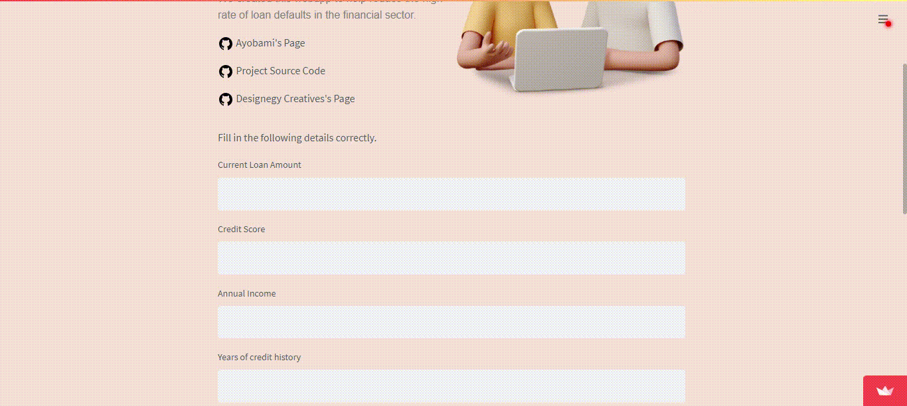

    

---

---

#### This Web app is built on Streamlit with Python Programming to predict which customer will default on their loan repayment plan.
---
### Animation Files
- [Ouch!](https://icons8.com/illustrations/)
---
[View App](https://ayobami6-projectcollaboration-github-io-appsbetaapp-4f6cqn.streamlitapp.com//)
